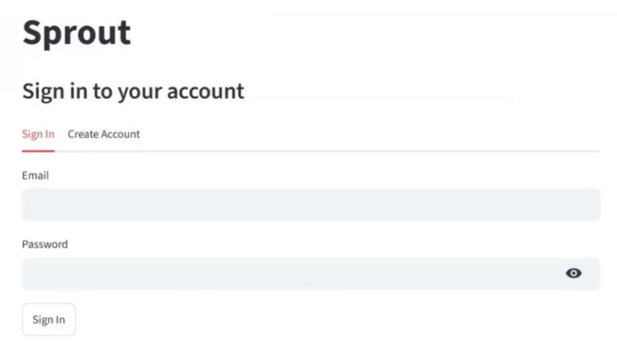
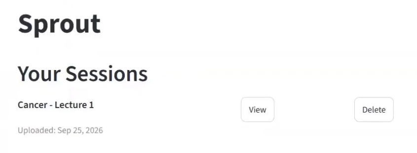
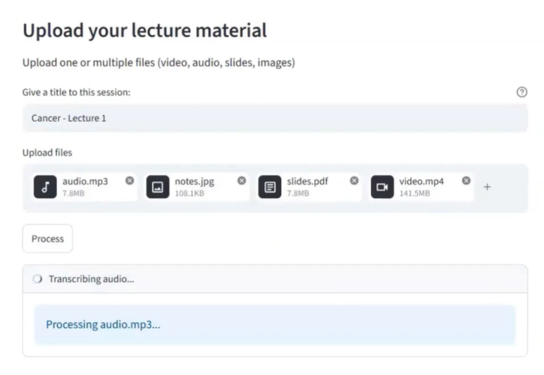
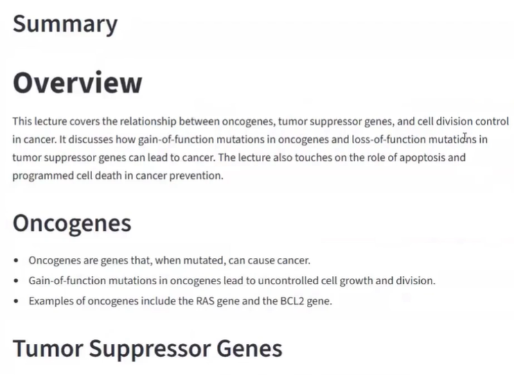
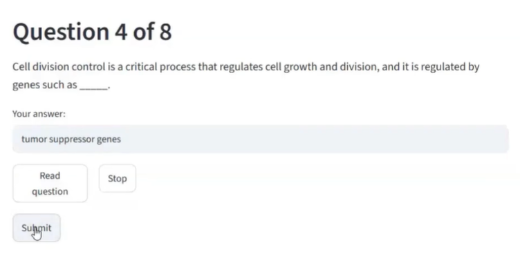
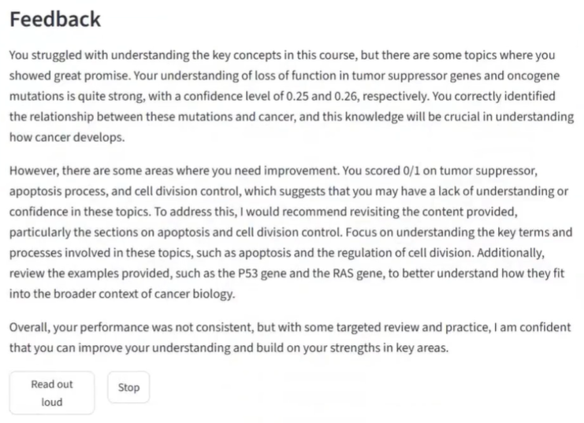
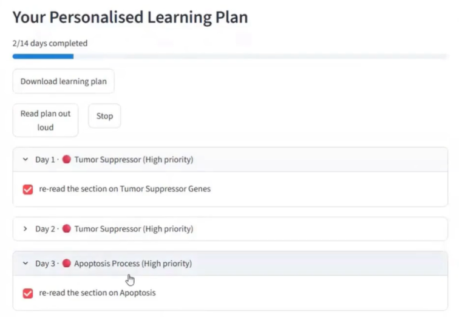

# Sprout: Your Personal AI Tool for Academic Growth

Sprout is a multimodal study assistant that uses lecture material and student performance to generate customised learning resources. Students upload academic videos, audios, PDFs, PPTXs and/or images of handwritten or scanned notes, and these are used to generate a summary and quiz. While taking the quiz, response times to each question are recorded. These response times are used in conjunction with whether or not each answer was correct to calculate **confidence scores**. Confidence scores are used to generate personalised feedback and a personalised learning plan that allocates priorities to topics depending on the confidence scores achieved therein.

All pretrained models used run locally via **[Ollama](https://ollama.com)** and **[Hugging Face](https://huggingface.co)**. Study sessions are saved and accounts are authenticated using **[Supabase](https://supabase.com)**.

## How it works
1. **Upload**: upload accepted file types and give the session a title
2. **Extraction & Ingestion**: files are split into text, images, and audio:
    - uploaded audio or audio extracted from uploaded videos using ``ffmpeg`` is transcribed using ``Whisper``
    - text and images are extracted from PDFs and PPTXs using ``PyMuPDF`` and ``pptx``
    - uploaded images of notes have OCR applied to read text using ``TrOCR``
    - images extracted from uploaded PDFs/PPTXs are described using ``LLaVa-7B``
3. **Fusion**: all of the ingested text is fused into a single string
4. **Generation**: ``Llama3.2`` uses the fused text to generate a structured summary and quiz
5. **Assessment**: response times to quiz questions are recorded and used to generate confidence scores
6. **Personalisation**: the confidence scores are used by ``Llama3.2`` to generate personalised feedback and a personalised learning plan
7. **Data persistence**: the summary, confidence scores, feedback and plan are saved to ``Supabase``
8. **User Interface**: ``Streamlit`` is used to display everything to the screen

The summary, quiz questions, feedback and learning plan can be read out loud using ``pyttsx3``.

## Pretrained models used
- **Audio**: ``Whisper``
- **Vision-language**: ``LLaVa-7B``
- **Image (OCR)**: ``TrOCR``
- **Text**: ``Llama3.2``

## How to Run

### 1. Install prerequisites

- **Python 3.10+**
- **[Ollama](https://ollama.com/download)** (installed and running)
- **[FFmpeg](https://ffmpeg.org/download.html)** (added to `PATH`)
- A free **[Supabase](https://supabase.com)** account

### 2. Clone & install dependencies

Clone the repository:
```bash
git clone https://github.com/ManahilMuhammad/cm3070-final-project.git
```

Install dependencies:
```bash
pip install ollama streamlit transformers whisper supabase torch \ opencv-python imagehash pillow pymupdf python-pptx pdfplumber pyttsx3
```

### 3. Pull Ollama models

```bash
ollama pull llama3.2:3b
ollama pull llava:7b
```

### 4. Set up a Supabase project

1. Create a new Supabase project
2. Open the **SQL Editor** for the project in Supabase and run the script in [supabase_schema.sql](supabase_schema.sql). This will create the `LECTURES` and `RESULTS` tables for storage, and grant access to signed-in users
3. Create a new file in the ``.streamlit`` folder called ``secrets.toml`` and paste the text from [secrets.toml.example](.streamlit/secrets.toml.example) into it, replacing the placeholders with your own project URL and anon key

### 5. Run the app

Ensure that **Ollama** is running, then run:

```bash
streamlit run app.py
```

You can now view the app at http://localhost:8501

## User Interface Previews

| Screen | Preview |
|---|---|
| Sign in / Sign up | 
| Home | 
| Upload | 
| Summary | 
| Quiz questions | 
| Feedback | 
| Learning plan | 

## Acknowledgements
This project was built as the final project for the CM3070 Final Project module.
